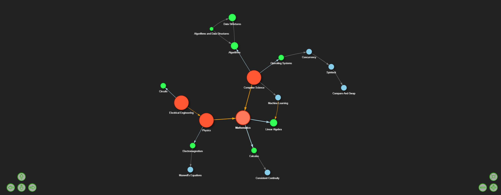
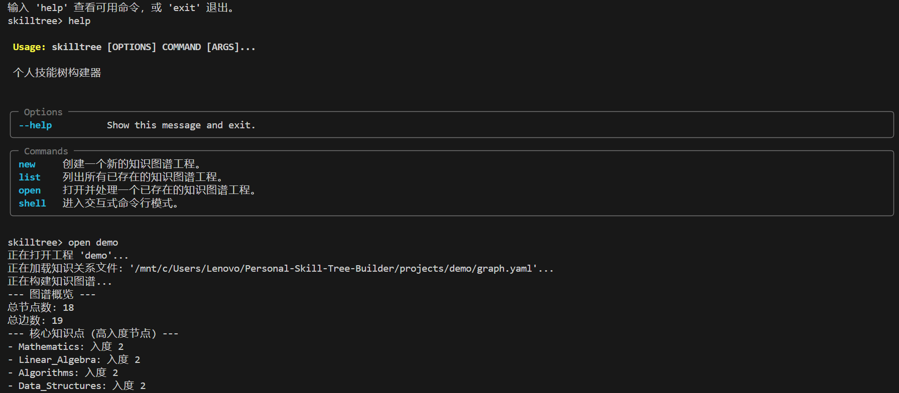

# Graph Relationship Management Tool 🛠️🌲

[](README.md) [](README_CN.md)

A Python-based command-line tool for defining, visualizing, and managing generic graph-based relationships. While initially conceived for personal skill trees and knowledge graphs, its flexible YAML-based data structure allows it to model and explore various types of interconnected data.

**🚧 CURRENT STATUS: Early Development - Simple Demo 🚧**

This project is currently in its early stages of development. The existing features provide a foundational CLI for graph definition and interactive HTML visualization. Significant enhancements, including a more robust CLI and a potential web-based GUI, are planned for the future. Your feedback and contributions are highly welcome at this stage!

---

## 🖼️ Visualizations

**Interactive HTML GUI (via Pyvis):**

*An example of the interactive HTML output generated by the tool.*

**Command-Line Interface (CLI):**

*A glimpse of the command-line interaction.*

---

## 💡 Why This Tool?

Many systems, concepts, and datasets can be understood as a network of interconnected entities. Whether it's mapping:

*   Personal skills and knowledge domains.
*   Dependencies in a software project.
*   Organizational structures.
*   Character relationships in a story.
*   Or any other system बेस्ट represented as a graph.

This tool aims to provide a simple yet effective way to:

*   **Define Relationships Clearly:** Use a structured YAML format to explicitly define nodes (entities) and edges (their connections) along with custom attributes.
*   **Visualize Connections:** Generate interactive HTML visualizations to explore the graph structure intuitively.
*   **Gain Macro Insights:** Understand the overall structure, identify key entities, and discover patterns in your data.
*   **Maintain a Centralized Record:** Keep your graph definitions organized in project-based folders.

## ✨ Current Features (Early Demo)

*   **Flexible Data Input with YAML:** Define nodes and edges using `graph.yaml` files within each project, supporting custom attributes for rich data modeling.
*   **Project-Based Organization:** Manage multiple graph projects, each in its own folder.
*   **Graph Construction:** Utilizes `networkx` to build a directed graph.
*   **Interactive HTML Visualization:** Generates an interactive HTML graph using `pyvis`.
*   **Local Web Server for Viewing:** Serves the HTML visualization via a local HTTP server for easy browser access.
*   **Basic CLI (`Typer` based):**
    *   `new`: Create new graph projects with a sample `graph.yaml`.
    *   `list`: List existing projects.
    *   `open`: Process a project's `graph.yaml`, generate outputs (HTML, GEXF), and start the local web server. It also includes a simple terminal query mode.
    *   `shell`: An interactive shell for running the above commands.
*   **Basic Graph Analysis:** Prints node/edge counts and high in-degree/out-degree nodes.
*   **GEXF Export:** Allows exporting graph data for use in tools like [Gephi](https://gephi.org/).
*   **Internationalization (CLI):** Supports English and Simplified Chinese.

## 🚀 Getting Started

### Prerequisites

*   Python 3.7+

### Installation

1.  **Clone the repository:**
    ```bash
    git clone https://github.com/Miki-Riako/Personal-Skill-Tree-Builder.git
    cd Personal-Skill-Tree-Builder 
    ```
    *(You might want to rename the repository if it's no longer just a "Skill Tree Builder")*

2.  **Set up a Virtual Environment (Recommended):**
    ```bash
    python -m venv venv
    # Activate: .\venv\Scripts\activate (Windows) or source venv/bin/activate (macOS/Linux)
    ```

3.  **Install Dependencies:**
    Create/update `requirements.txt` with:
    ```txt
    networkx>=2.5
    pyvis>=0.1.9
    PyYAML>=5.4
    typer>=0.4.0
    # pyperclip # Optional
    ```
    Then run:
    ```bash
    pip install -r requirements.txt
    ```

### Basic Usage

1.  **Create a Project:**
    ```bash
    python main.py new MyFirstGraph
    ```

2.  **Define Your Graph:**
    Edit `projects/MyFirstGraph/graph.yaml`. See [Manual (Manual.md)](Manual.md) for the YAML format.

3.  **Process and View:**
    ```bash
    python main.py open MyFirstGraph
    ```
    This starts a local server and prints a URL (e.g., `http://localhost:5000/skill_tree.html`). Open this URL in your browser.

For more commands, see the [CLI Manual (Manual.md)](Manual.md).

## ⚙️ Configuration

A `config.yaml` file in the project root stores global settings (default language, web server port).

## 🗺️ Future Roadmap (Planned Enhancements)

This is an early-stage project with many exciting possibilities:

*   **Enhanced CLI:**
    *   More robust error handling and user feedback.
    *   Commands for direct graph manipulation (add/edit/delete nodes/edges via CLI).
    *   Advanced querying capabilities.
*   **Web-Based GUI:**
    *   A user-friendly web interface for creating, editing, visualizing, and interacting with graphs. This is a major planned feature.
*   **Advanced Graph Analysis:**
    *   Integrate algorithms for community detection, shortest paths, centrality measures, etc., accessible via CLI and GUI.
*   **Data Import/Export:**
    *   Support for more graph formats (e.g., GraphML, JSON Graph Format).
    *   Integration or compatibility with other PKM or diagramming tools.
*   **Visualization Customization:**
    *   More control over visual styles (colors, shapes, layouts) directly from the UI or configuration.
*   **Persistence Options:**
    *   Explore database backends for larger graphs or collaborative scenarios.

## 🤝 Contributing

Given the early stage, contributions, feedback, bug reports, and feature requests are especially welcome! Please feel free to open an issue or a pull request.

## 📜 License

This project is open source. (Consider adding a specific license, e.g., MIT License).