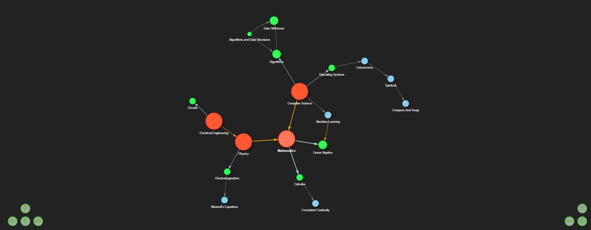
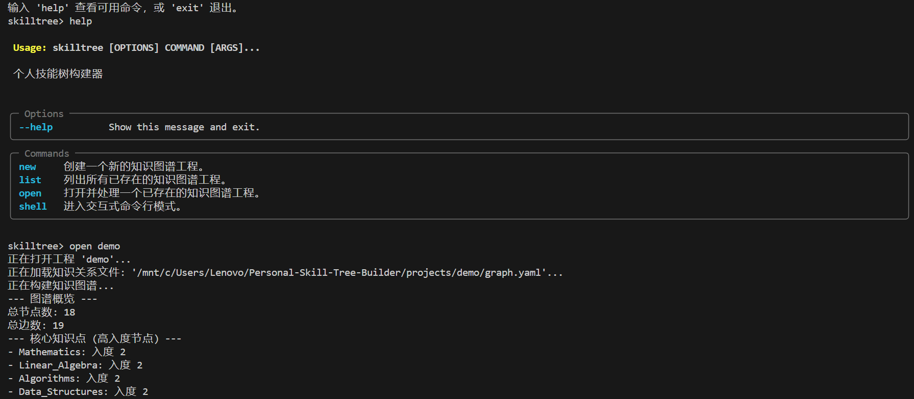

# 通用图关系管理工具 🛠️🌲

[](README.md) [](README_CN.md)

一个基于 Python 的命令行工具，用于定义、可视化和管理通用的基于图的关系。虽然最初是为个人技能树和知识图谱而设计，但其灵活的基于 YAML 的数据结构使其能够建模和探索各种类型的相互关联的数据。

**🚧 当前状态：早期开发 - 简单演示版 🚧**

本项目目前处于早期开发阶段。现有功能提供了一个基础的命令行界面（CLI），用于图的定义和交互式HTML可视化。未来计划进行重大增强，包括更强大的CLI和潜在的基于Web的图形用户界面（GUI）。在此阶段，我们非常欢迎您的反馈和贡献！

---

## 🖼️ 可视化效果

**交互式 HTML GUI (通过 Pyvis 生成):**

*工具生成的交互式HTML输出示例。*

**命令行界面 (CLI):**

*命令行交互一瞥。*

---

## 💡 为何选择此工具？

许多系统、概念和数据集都可以理解为相互连接的实体网络。无论是映射：

*   个人技能和知识领域。
*   软件项目中的依赖关系。
*   组织结构。
*   故事中的人物关系。
*   或任何其他最适合用图表示的系统。

本工具旨在提供一种简单而有效的方法来：

*   **清晰定义关系：** 使用结构化的 YAML 格式明确定义节点（实体）和边（它们的连接）以及自定义属性。
*   **可视化连接：** 生成交互式 HTML 可视化，直观地探索图结构。
*   **获得宏观洞察：** 理解整体结构，识别关键实体，并发现数据中的模式。
*   **维护集中记录：** 将您的图定义组织在基于项目的文件夹中。

## ✨ 当前特性 (早期演示版)

*   **灵活的 YAML 数据输入：** 在每个项目中使用 `graph.yaml` 文件定义节点和边，支持自定义属性以进行丰富的数据建模。
*   **基于项目的组织：** 管理多个图项目，每个项目都在其自己的文件夹中。
*   **图构建：** 利用 `networkx` 构建有向图。
*   **交互式 HTML 可视化：** 使用 `pyvis` 生成交互式 HTML 图。
*   **本地 Web 服务器查看：** 通过本地 HTTP 服务器提供 HTML 可视化，方便浏览器访问。
*   **基础 CLI (基于 `Typer`)：**
    *   `new`：创建新的图项目，并附带示例 `graph.yaml`。
    *   `list`：列出现有项目。
    *   `open`：处理项目的 `graph.yaml`，生成输出（HTML、GEXF），并启动本地 Web 服务器。它还包括一个简单的终端查询模式。
    *   `shell`：用于运行上述命令的交互式 shell。
*   **基本图分析：** 打印节点/边计数以及高入度/出度节点。
*   **GEXF 导出：** 允许导出图数据，以便在 [Gephi](https://gephi.org/) 等工具中使用。
*   **国际化 (CLI)：** 支持英语和简体中文。

## 🚀 开始使用

### 先决条件

*   Python 3.7+

### 安装

1.  **克隆仓库：**
    ```bash
    git clone https://github.com/Miki-Riako/Personal-Skill-Tree-Builder.git 
    cd Personal-Skill-Tree-Builder 
    ```
    *(如果项目不再仅仅是“技能树构建器”，您可能需要重命名仓库)*

2.  **设置虚拟环境 (推荐)：**
    ```bash
    python -m venv venv
    # 激活: .\venv\Scripts\activate (Windows) 或 source venv/bin/activate (macOS/Linux)
    ```

3.  **安装依赖：**
    创建/更新 `requirements.txt` 文件内容如下:
    ```txt
    networkx>=2.5
    pyvis>=0.1.9
    PyYAML>=5.4
    typer>=0.4.0
    # pyperclip # 可选
    ```
    然后运行:
    ```bash
    pip install -r requirements.txt
    ```

### 基本用法

1.  **创建项目：**
    ```bash
    python main.py new 我的第一个图
    ```

2.  **定义您的图：**
    编辑 `projects/我的第一个图/graph.yaml`。有关 YAML 格式，请参阅[手册 (Manual_CN.md)](Manual_CN.md)。

3.  **处理和查看：**
    ```bash
    python main.py open 我的第一个图
    ```
    这将启动一个本地服务器并打印一个 URL (例如, `http://localhost:5000/skill_tree.html`)。在浏览器中打开此 URL。

更多命令请参阅 [CLI 手册 (Manual_CN.md)](Manual_CN.md)。

## ⚙️ 配置

项目根目录中的 `config.yaml` 文件存储全局设置（默认语言、Web 服务器端口）。

## 🗺️ 未来规划 (计划中的增强功能)

这是一个早期阶段的项目，具有许多令人兴奋的可能性：

*   **增强的 CLI：**
    *   更强大的错误处理和用户反馈。
    *   通过 CLI 直接进行图操作的命令（添加/编辑/删除节点/边）。
    *   高级查询功能。
*   **基于 Web 的 GUI：**
    *   一个用户友好的 Web 界面，用于创建、编辑、可视化和交互式操作图。这是一个主要的计划特性。
*   **高级图分析：**
    *   集成社区检测、最短路径、中心性度量等算法，可通过 CLI 和 GUI 访问。
*   **数据导入/导出：**
    *   支持更多图格式（例如 GraphML、JSON 图格式）。
    *   与其他个人知识管理（PKM）或图表工具的集成或兼容性。
*   **可视化定制：**
    *   从 UI 或配置中更直接地控制视觉样式（颜色、形状、布局）。
*   **持久化选项：**
    *   探索用于较大数据图或协作场景的数据库后端。

## 🤝 贡献

鉴于项目尚处于早期阶段，我们特别欢迎贡献、反馈、错误报告和功能请求！请随时创建 issue 或提交 pull request。

## 📜 许可证

本项目开源。(可以考虑添加具体的许可证，例如 MIT 许可证)。